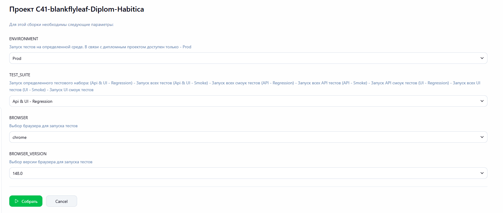
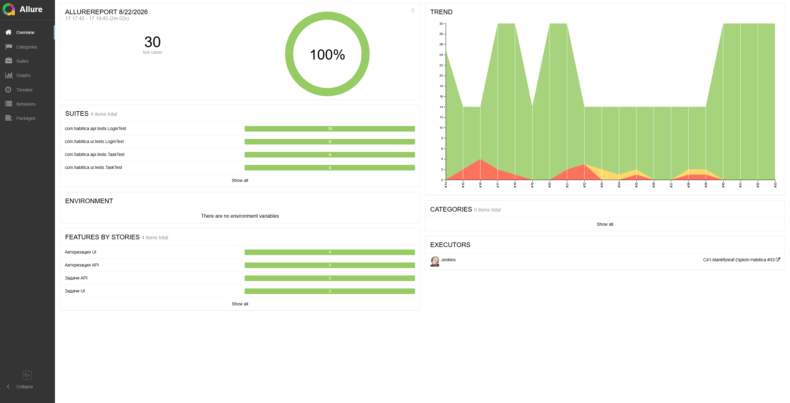
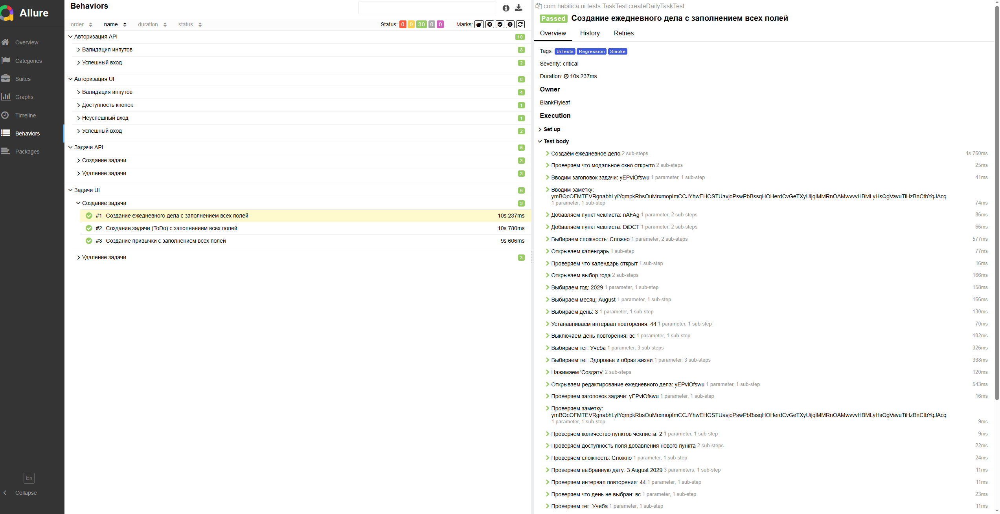
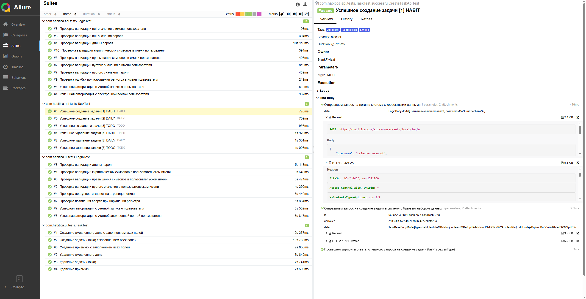
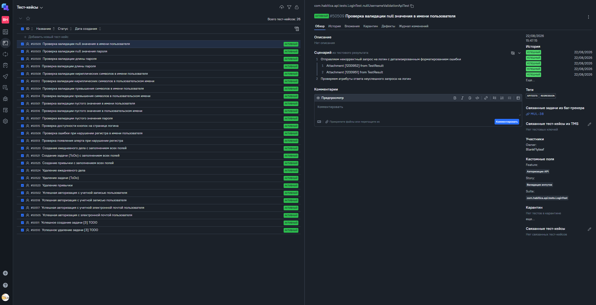
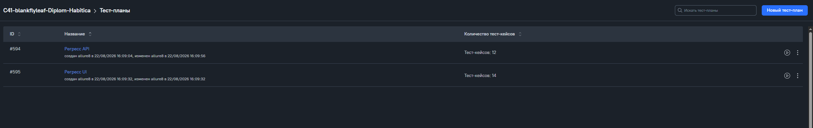
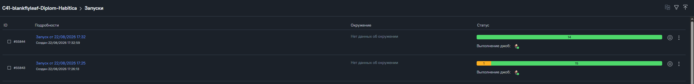
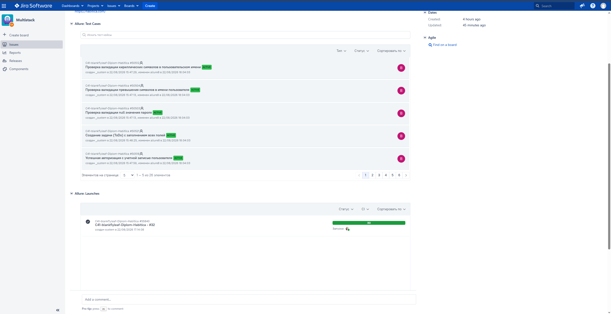

<div align="center">


# ⚔️ Habitica — Автоматизация тестирования

> *Превращай баги в монстров. Убивай их тестами.*

[](https://openjdk.org/)
[](https://gradle.org/)
[](https://junit.org/junit5/)
[](https://selenide.org/)
[](https://rest-assured.io/)

[](https://allurereport.org/)
[](https://qameta.io/)
[](https://www.jenkins.io/)
[](https://aerokube.com/selenoid/)
[](https://jira.autotests.cloud/)
[](https://t.me/)

</div>

---

## 🗺️ О проекте

**[Habitica](https://habitica.com)** — приложение для управления привычками и задачами в формате RPG-игры. Пользователь создаёт персонажа, выполняет реальные задачи и получает игровые награды.

Этот репозиторий содержит дипломный проект по автоматизации тестирования Habitica, выполненный в рамках курса **QA.GURU**. Проект покрывает **API** и **UI** тесты с интеграцией в CI/CD.

---

## 🧪 Тестовое покрытие

### ⚔️ Feature: Авторизация API

| # | Story | Тест-кейс | Тип |
|---|---|---|---|
| 1 | Успешный вход | Успешная авторизация с учётной записью пользователя | ✅ Позитивный |
| 2 | Успешный вход | Успешная авторизация с электронной почтой пользователя | ✅ Позитивный |
| 3 | Валидация инпутов | Проверка ошибки при нарушении регистра в имени пользователя | ❌ Негативный |
| 4 | Валидация инпутов | Проверка валидации пустого значения в имени пользователя | ❌ Негативный |
| 5 | Валидация инпутов | Проверка валидации null значения в имени пользователя | ❌ Негативный |
| 6 | Валидация инпутов | Проверка валидации превышения символов в имени пользователя | ❌ Негативный |
| 7 | Валидация инпутов | Проверка валидации кириллических символов в имени пользователя | ❌ Негативный |
| 8 | Валидация инпутов | Проверка валидации пустого значения пароля | ❌ Негативный |
| 9 | Валидация инпутов | Проверка валидации null значения пароля | ❌ Негативный |
| 10 | Валидация инпутов | Проверка валидации длины пароля | ❌ Негативный |

### 🗡️ Feature: Задачи API

| # | Story | Тест-кейс | Тип |
|---|---|---|---|
| 1 | Создание задачи | Успешное создание Привычки (Habit) | ✅ Позитивный |
| 2 | Создание задачи | Успешное создание Ежедневного дела (Daily) | ✅ Позитивный |
| 3 | Создание задачи | Успешное создание Задачи (ToDo) | ✅ Позитивный |
| 4 | Удаление задачи | Успешное удаление Привычки (Habit) | ✅ Позитивный |
| 5 | Удаление задачи | Успешное удаление Ежедневного дела (Daily) | ✅ Позитивный |
| 6 | Удаление задачи | Успешное удаление Задачи (ToDo) | ✅ Позитивный |

### 🛡️ Feature: Авторизация UI

| # | Story | Тест-кейс | Тип |
|---|---|---|---|
| 1 | Успешный вход | Успешная авторизация с учётной записью пользователя | ✅ Позитивный |
| 2 | Успешный вход | Успешная авторизация с электронной почтой пользователя | ✅ Позитивный |
| 3 | Неуспешный вход | Проверка появления алерта при нарушении регистра | ❌ Негативный |
| 4 | Доступность кнопок | Проверка доступности кнопок на странице логина | ✅ Позитивный |
| 5 | Валидация инпутов | Проверка валидации пустого значения в пользовательском имени | ❌ Негативный |
| 6 | Валидация инпутов | Проверка валидации превышения символов в пользовательском имени | ❌ Негативный |
| 7 | Валидация инпутов | Проверка валидации кириллических символов в пользовательском имени | ❌ Негативный |
| 8 | Валидация инпутов | Проверка валидации длины пароля | ❌ Негативный |

### 🏹 Feature: Задачи UI

| # | Story | Тест-кейс | Тип |
|---|---|---|---|
| 1 | Создание задачи | Создание Привычки с заполнением всех полей | ✅ Позитивный |
| 2 | Создание задачи | Создание Ежедневного дела с заполнением всех полей | ✅ Позитивный |
| 3 | Создание задачи | Создание Задачи (ToDo) с заполнением всех полей | ✅ Позитивный |
| 4 | Удаление задачи | Удаление Привычки (Habit) | ✅ Позитивный |
| 5 | Удаление задачи | Удаление Ежедневного дела (Daily) | ✅ Позитивный |
| 6 | Удаление задачи | Удаление Задачи (ToDo) | ✅ Позитивный |

---

## 🚀 Запуск тестов

### Локально

```bash
# Все тесты
./gradlew test

# По тегу
./gradlew test -DincludeTags="Smoke"
./gradlew test -DincludeTags="Regression"
./gradlew test -DincludeTags="ApiTests"
./gradlew test -DincludeTags="UiTests"

# Комбинированный тег
./gradlew test -DincludeTags="Smoke & ApiTests"
```

### Через Selenoid (remote)

```bash
./gradlew test \
  -Denv=remote \
  -DbrowserName=chrome \
  -DbrowserVersion=128.0 \
  -DremoteUrl=http://<selenoid-host>:4444/wd/hub
```

### Параметры конфигурации

| Параметр | По умолчанию | Описание |
|---|---|---|
| `browserName` | `chrome` | Браузер |
| `browserVersion` | `128.0` | Версия браузера |
| `browserSize` | `1920x1080` | Размер окна |
| `baseUrl` | `https://habitica.com` | Базовый URL |
| `remoteUrl` | — | URL Selenoid |
| `env` | `local` | Окружение (local / remote) |

---

## 🔧 CI/CD — Jenkins

Сборка настроена как **Freestyle Job** с параметрами:

<div align="center">
  <a href="media/Jenkins-1.png">
    
  </a>
</div>

| Параметр | Тип | Значения |
|---|---|---|
| `BROWSER` | Choice | Chrome, Firefox |
| `BROWSER_VERSION` | Active Choices Reactive | Chrome: 148, 149 · Firefox: 150, 151 |
| `ENVIRONMENT` | Choice | Prod |
| `TEST_SUITE` | Choice | Api & UI — Regression, Api & UI — Smoke, API — Regression, API — Smoke, UI — Regression, UI — Smoke |

В зависимости от выбранного `TEST_SUITE` запускаются соответствующие наборы тестов.

---

## 📊 Отчётность

### Allure Report

```bash
./gradlew allureReport
./gradlew allureServe
```

<div align="center">
  <a href="media/Allure-1.png">
    
  </a>
</div>

Отчёт включает:

- Dashboard с общей статистикой
- Дерево тест-кейсов по Feature / Story
- Скриншоты последнего состояния браузера
- Видеозаписи из Selenoid
- Логи консоли браузера
- Тела HTTP-запросов и ответов (REST Assured) с кастомным форматированием

#### Примеры других страниц

<div align="center">
  <a href="media/Allure-2.png">
    
  </a>
  <a href="media/Allure-3.png">
    
  </a>
</div>

#### Пример видео-прогона теста

<div align="center">
  
</div>

### Allure TestOps

Все запуски автоматически попадают в **Allure TestOps**. Каждый прогон из Jenkins создаёт Launch с полным набором результатов.

<div align="center">
  <a href="media/TestOps-1.png">
    
  </a>
</div>

Для удобства настроены тест-планы — можно запустить нужный набор тестов прямо из TestOps:

<div align="center">
  <a href="media/TestOps-2.png">
    
  </a>
  <a href="media/TestOps-3.png">
    
  </a>
</div>

### 🔗 Jira

Настроена интеграция с Jira для отслеживания дефектов и связи тест-кейсов с задачами:

<div align="center">
  <a href="media/Jira-1.png">
    
  </a>
</div>

---

## 📨 Telegram Notifications

После каждого прогона в Jenkins автоматически отправляется уведомление в Telegram-чат с результатами сборки.

Уведомление включает:

- Статус сборки (успех / провал)
- Количество пройденных, упавших и пропущенных тестов
- Ссылку на Allure-отчёт
- Ссылку на сборку в Jenkins

---

<div align="center">

*⚔️ Квест пройден. Баги побеждены. 🏆*

[@BlankFlyleaf](https://github.com/BlankFlyleaf)

</div>
